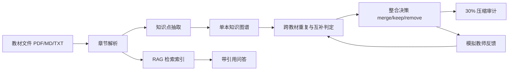

# Agent 架构说明

## 1. 项目定位

本项目是面向医学教材的知识整合智能体。系统把多本教材解析为章节、知识点和关系，再进行跨教材重复识别、互补内容保留、压缩决策审计，并提供带原文引用的 RAG 问答和模拟教师反馈入口。

本文档描述当前目标架构和已验证的 MVP 行为。公网交付采用 GitHub Pages 静态 Demo，本地 FastAPI 后端用于复现真实教材解析、RAG、压缩审计和模拟反馈闭环；本文不虚构尚未完成的 7 本教材全量结果、公网后端、向量化 RAG 或真实教师反馈。

## 2. Agent 任务边界

智能体不是单纯聊天入口，而是围绕教材整合流程的编排器：

1. 教材解析 Agent：读取 PDF/Markdown/TXT，生成教材、章节、页码和正文片段。
2. 知识抽取 Agent：从章节片段中抽取概念、定义、类别、来源教材、章节和页码。
3. 图谱构建 Agent：把知识点组织成节点和边，至少支持 `contains`、`prerequisite`、`related` 三类关系。
4. 跨教材整合 Agent：识别同义、近义、重复讲解和互补内容，输出 `merge / keep / remove` 决策。
5. 压缩审计 Agent：计算压缩比，检查整合后是否不超过原始正文体量的 30%。
6. RAG 问答 Agent：基于教材片段检索并生成答案，返回教材、章节、页码、相关度和原文片段。
7. 教师反馈 Agent：接收模拟教师反馈，对整合决策进行保留、拆分、合并或删除，并刷新决策结果。

## 3. 核心数据流



## 4. 知识点粒度

知识点节点可以是概念、结构、方法、机制、现象、疾病、病理过程或教学步骤。每个节点至少应包含名称、类型、定义或摘要、来源教材、章节、页码和关系。

粒度原则是“能支撑教学判断”。过粗会无法解释为什么合并，过细会让图谱碎片化。MVP 中优先采用章节内的核心概念和高频术语作为节点。

## 5. 重复判定规则

重复不等于文字完全相同。系统应把候选知识点分为三类：

- 可合并：同一医学概念的不同表述，例如同义词、简称、翻译差异、定义重复。
- 应保留：上下位概念、前后置机制、不同教材的互补解释。
- 可删除：同一概念的重复讲解，且删除后不破坏前置依赖链路。

每条整合决策必须保留理由、受影响节点、结果节点和置信度。报告中不能只给最终压缩比，还要说明被合并或删除的依据。

## 6. 30% 压缩口径

压缩公式固定为：

```text
压缩比 = 整合后保留内容总字数 / 原始正文总字数 * 100%
```

目标是压缩比小于或等于 30%。原始正文总字数应尽量排除目录、页眉页脚、重复空白；整合后字数不能只统计知识点名称，应统计保留知识点的定义、解释和必要摘要。

当前后端 smoke test 的样例结果为：原始正文 65535 字符，整合后 3184 字符，压缩比 4.86%，达到 30% 目标。该结果来自 2 本教材的 MVP 页窗，不代表 7 本教材全量处理结果。

## 7. RAG 引用策略

RAG 回答必须优先从教材片段中检索依据，再生成答案。返回结构应包含：

- `answer`：面向用户的简洁回答。
- `citations`：教材名、章节、页码、相关度、原文片段。
- `found`：是否命中可靠教材依据。

未命中时必须返回“当前知识库中未找到相关信息”，不能编造医学结论。Embedding 服务不稳定时，可以降级为 TF-IDF 或关键词检索，但需要在 README 和系统设计中说明。

## 8. 模拟教师反馈

当前比赛环境中不假设真实教师在线。系统可提供“模拟教师反馈”入口，并明确标注为模拟。至少应支持一种真实可执行修改：

- 保留：撤销某条删除或合并决策。
- 拆分：把错误合并的知识点拆回两个节点。
- 合并：把漏合并的重复概念合并。
- 删除：确认某个重复解释不进入精简版。

已验证行为：后端 smoke test 中提交一条“模拟教师反馈：该点教学价值高，保留。”后，一条整合决策被更新为 `keep`，状态变为 `updated_by_feedback`，反馈事件数变为 1。

## 9. 失败与降级

- PDF 解析失败：显示失败教材名和错误原因，保留其他教材结果。
- 模型调用失败：保留已解析章节，提示模型暂不可用。
- 检索未命中：返回固定未找到文案和空引用列表。
- 压缩未达标：展示当前压缩比和超出原因，不伪装达标。
- 部署后 API 不可用：前端展示 Demo 数据和接口说明，避免白屏。

## 10. 创新点与取舍

### 创新点

- 教师四问评审栏：把“为什么合并、来源在哪、压缩是否达标、问答有没有引用”前置到界面主流程，让评委能快速检查系统是否真的围绕教材整合问题工作。
- 教学关键路径：在图谱中突出关键医学概念链路，避免系统只做机械去重而破坏教学顺序。
- 压缩审计：把 30% 指标做成可解释数值，而不是只给一个无法追溯的摘要。
- 引用式 RAG：回答必须带教材、章节、页码、相关度和片段；未命中时返回固定未找到文案，避免编造医学结论。
- 模拟教师反馈闭环：至少能把一条整合决策改为保留，并记录反馈事件，展示“人类教学判断可以修正系统决策”的方向。

### 比赛时限下的取舍

- 公网优先选择静态 Demo，保证链接稳定可打开；后端保留为本地可复现服务，不临时冒险部署公网后端。
- RAG 当前采用关键词/规则检索，不写成 embedding、向量库或 rerank 已完成。
- 知识抽取和整合以规则、术语和同义判断为主，不写成每章都已调用 LLM 语义抽取。
- 当前 smoke test 覆盖 2 本教材页窗，不写成 7 本教材全量处理。
- 教师反馈为模拟反馈，不写成真实教师在线多轮评审。

## 11. 当前待修正点

- 前后端主面板接口已对齐到 `/api/dashboard`。
- RAG 引用已经能返回教材、章节、页码和片段，但样例片段仍有少量目录噪声，需要后端继续清洗。
- GitHub Public 仓库和 GitHub Pages 链接已生成；技术报告飞书链接仍需提交前回填。
